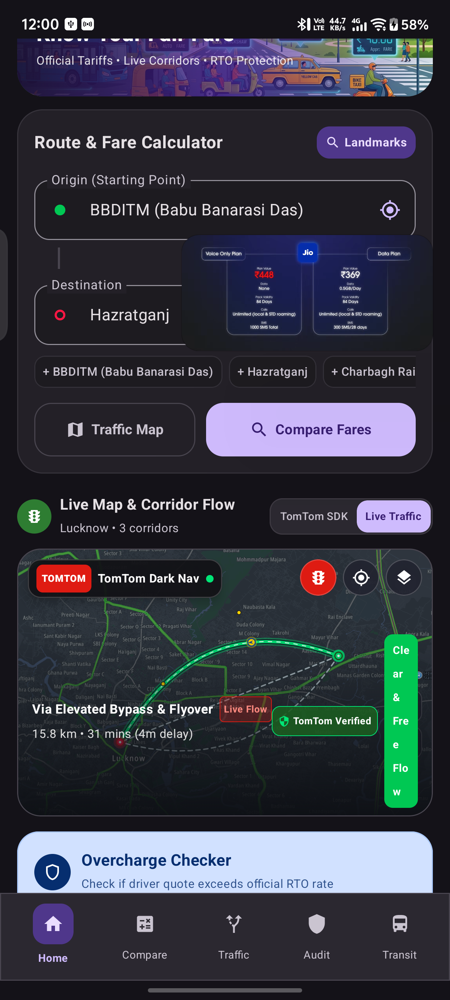
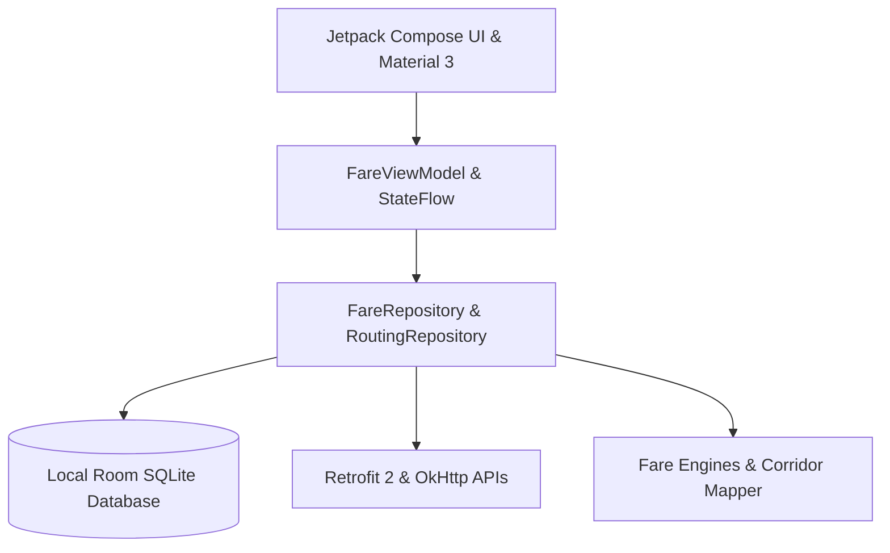

# 🚖 FairFare — Smart Transport Fare & Transit Auditor for Android

[](https://android.com)
[](https://kotlinlang.org)
[](https://developer.android.com/jetpack/compose)
[-brightgreen?style=for-the-badge)](https://developer.android.com)
[](https://developer.android.com)
[](LICENSE)

> **FairFare** is an intelligent, privacy-first Android application designed to protect commuters from overcharging, demystify public transport tariffs, and provide instant multi-modal fare & duration comparisons across Auto-Rickshaws, Cabs, Buses, Metro, and Bike Taxis.

---

## 📱 App Previews

| Home & Transit Search | Live Route & Traffic Map | Fare Comparison & Audit |
| :---: | :---: | :---: |
|  |  |  |

---

## 🌟 Core Features

### 1. ⚖️ Multi-Modal Fare & ETA Comparison
- Calculates precise fare estimates and expected journey durations for **Auto-Rickshaws**, **E-Rickshaws**, **Bike Taxis**, **Mini Cabs**, **Sedan Cabs**, **Local Buses**, and **Metro Transit**.
- Automatically highlights the **Cheapest**, **Fastest**, and **Best Value** routes.
- **Smart Multi-Modal Suggestions**: Combines feeder transport (e.g. E-Rickshaw / Auto) with express Metro or Bus lines for maximum cost savings.

### 2. 🛡️ Live Meter Overcharge & Fare Auditor
- Audit any demanded driver fare against statutory government RTO meter tariffs.
- Factors in:
  - Base distance & base minimum fare
  - Incremental per-kilometer rates
  - Night surcharge percentage (e.g. 25% from 11:00 PM to 05:00 AM)
  - Waiting charges & luggage fees
- Provides actionable **Bargaining Advice**, fair counter-offer ranges, and official legal rights citations.

### 3. 🗺️ Traffic Corridor Mapping & Delay Estimation
- Interactive map visualization showing route geometry, waypoints, and congestion segments.
- Identifies **Clear / Moderate / Heavy / Severe Bottlenecks** and computes traffic delay penalties on fares and travel time.
- Offline-ready corridor mapping for key city routes with automatic keyless tile fallback.

### 4. 📜 Official Government Tariff Database
- Pre-populated, offline-capable database of government-approved tariff schedules across major Indian metropolitan areas:
  - **Lucknow**, **Delhi NCR**, **Mumbai**, **Bengaluru**, **Kolkata**, **Hyderabad**.
  - Rate breakdown per vehicle class, official notifications, and verified update dates.

### 5. 🚌 Bus & Metro Transit Guide
- Search local bus schedules, line numbers, first/last bus timings, stage frequencies, and AC / Non-AC ticket costs.

### 6. 📢 Crowdsourced Incident Reporting
- Submit reports for fare overcharging, meter refusal, broken meters, or rude behavior to build community transparency.

### 7. 🎨 Dynamic Modern Material 3 UI
- Clean, responsive Jetpack Compose interface with seamless **Light & Dark Theme** switching and smooth transition animations.

---

## 🏗️ Architecture & Tech Stack

FairFare is engineered following modern Android development best practices and **Clean Architecture (MVVM)** principles:



- **UI & Presentation**: [Jetpack Compose](https://developer.android.com/jetpack/compose), Material 3, Edge-to-Edge window insets, Compose Animations.
- **State & Concurrency**: Android ViewModel, Kotlin Coroutines, `StateFlow`, `collectAsStateWithLifecycle`.
- **Local Persistence**: [Room Database (SQLite)](https://developer.android.com/training/data-storage/room) with KSP code generation and pre-populated initial datasets.
- **Networking**: [Retrofit 2](https://square.github.io/retrofit/), [OkHttp 3](https://square.github.io/okhttp/), Moshi JSON serialization.
- **Location & Mapping**: Google Play Services Location, Google Maps / TomTom SDK integrations with offline fallback.
- **Configuration & Security**: Secrets Gradle Plugin for zero-leak environment variables (`.env`).
- **Testing**: JUnit 4, Robolectric, AndroidX Test Runner, Roborazzi screenshot testing.

---

## 📂 Project Structure

```
fairfare/
├── app/
│   ├── src/
│   │   ├── main/
│   │   │   ├── java/com/example/
│   │   │   │   ├── MainActivity.kt               # App root, backstack navigation & themes
│   │   │   │   ├── data/
│   │   │   │   │   ├── local/                    # Room DB, DAOs, and Initial Tariff data
│   │   │   │   │   ├── model/                    # Domain models, Enums, and Entities
│   │   │   │   │   ├── remote/                   # Retrofit APIs, Geocoding, DTOs & Polyline
│   │   │   │   │   └── repository/               # FareRepository & RoutingRepository
│   │   │   │   ├── engine/                       # Fare calculation engine & corridor algorithms
│   │   │   │   └── ui/
│   │   │   │       ├── components/               # Bottom bar, map views, modals, dialogs
│   │   │   │       ├── screens/                  # Home, Compare, RouteMap, Audit, Tariffs
│   │   │   │       ├── theme/                    # Color schemes, Typography, Shapes
│   │   │   │       └── viewmodel/                # FareViewModel
│   │   │   ├── res/                              # Drawables, mipmaps, strings, XML configs
│   │   │   └── AndroidManifest.xml
│   │   └── test/                                 # Unit & Robolectric test suites
│   ├── build.gradle.kts                          # App build configuration & dependencies
│   └── proguard-rules.pro                        # R8 release optimization rules
├── gradle/
│   └── libs.versions.toml                        # Version catalog for dependencies
├── screenshots/                                  # App preview screenshots
├── .env.example                                  # Sample environment configuration template
├── build.gradle.kts                              # Root build script
├── settings.gradle.kts                           # Gradle repository and plugin settings
└── README.md
```

---

## 🚀 Getting Started

### Prerequisites

- **Android Studio** Ladybug (2024.2.1+) or newer
- **JDK 17** or **JDK 21**
- **Android SDK** with API level 35+ installed

### Step-by-Step Installation

1. **Clone the Repository**:
   ```bash
   git clone https://github.com/mohammadfaizansari786/fairfare.git
   cd fairfare
   ```

2. **Set up Environment Variables**:
   Copy the example `.env` template:
   ```bash
   cp .env.example .env
   ```
   *(Optional)* Add your API keys in `.env` if you have them:
   ```properties
   MAPS_API_KEY=your_google_maps_api_key_here
   TOMTOM_API_KEY=your_tomtom_api_key_here
   ```
   > 💡 **Note**: The app includes built-in offline routing and fallback tile renderers, so you can build and run immediately even without API keys!

3. **Build the Debug APK**:
   ```bash
   ./gradlew assembleDebug
   ```

4. **Run Unit Tests**:
   ```bash
   ./gradlew test
   ```

5. **Deploy to Device / Emulator**:
   Open the project in Android Studio and click **Run (Shift + F10)**.

---

## 🧪 Testing

The repository includes comprehensive unit and integration tests:
- `FareEngineTest.kt`: Validates base fares, per-km math, night charges, and peak multipliers across all vehicle types.
- `GeocodingTest.kt` & `RoutingTest.kt`: Tests address lookups and polyline decoding.
- `NavigationBarTest.kt`: Verifies navigation backstack state integrity.
- `ExampleRobolectricTest.kt`: Headless Android component testing.

Run all tests via:
```bash
./gradlew check
```

---

## 🤝 Contributing

Contributions are welcome! If you'd like to update official city tariffs, add new transit routes, or enhance features:

1. **Fork the Repository**
2. **Create a Feature Branch**:
   ```bash
   git checkout -b feature/new-city-tariffs
   ```
3. **Commit your Changes**:
   ```bash
   git commit -m "Add official RTO tariffs for Jaipur"
   ```
4. **Push to the Branch**:
   ```bash
   git push origin feature/new-city-tariffs
   ```
5. **Open a Pull Request**

---

## 📄 License

This project is licensed under the **MIT License** — see the [LICENSE](LICENSE) file for details.

---

<p align="center">Made with ❤️ for transparent, fair, and accessible public transit.</p>
